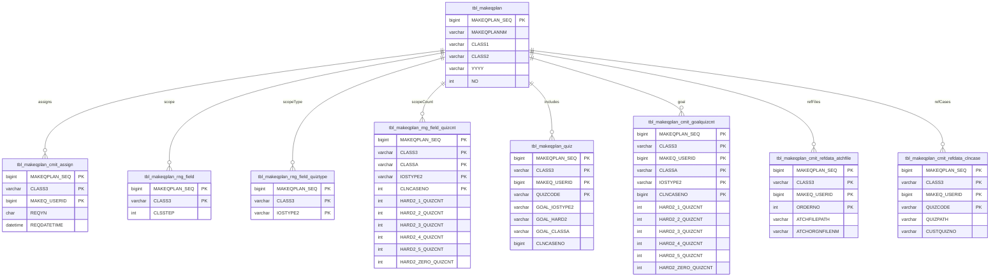

# KPS 2025 스키마 ERD (DDL 기반) — 검증본

본 문서는 사용자가 제공한 MariaDB DDL(내보내기 스크립트) 내용을 기준으로 ERD를 구성한 **검증본**입니다.

- DDL에 **FOREIGN KEY 제약이 거의/전혀 선언되어 있지 않아**, 관계선은 **컬럼명/PK 패턴 기반으로 “추정”**하여 표기했습니다.
- 따라서, 이 문서의 관계는 **설계 의도 또는 실제 JOIN 키와 다를 수 있으며**, 운영 쿼리(SELECT/JOIN) 또는 애플리케이션 코드 기준으로 최종 확정이 필요합니다.

---

## 1. 검증 결과 요약

### 1) PK/복합PK 구조 검증
- 각 테이블의 `PRIMARY KEY (...)` 구문을 기준으로 PK를 표기했습니다.
- 복합PK 테이블(예: `..._assign`, `..._quiz`, `..._atchfile` 등)은 DDL과 동일한 PK 컬럼 조합을 사용했습니다.

### 2) FK 부재로 인한 관계 “추정” 원칙
관계는 다음 규칙으로 추정했습니다.

- `QUIZCODE` → `tbl_quiz_quiz.QUIZCODE`
- `TESTCODE` → `tbl_quiz_test.TESTCODE`
- `TLFCODE` → `tbl_quiz_tlf.TLFCODE`
- `...PLAN_SEQ` → 해당 계획 테이블의 `...PLAN_SEQ`
- `MNUCD` → `tbl_mnu.MNUCD`, `DISPCD` → `tbl_disp.DISPCD`, `MNU_DISP_SEQ` → `tbl_mnu_disp.MNU_DISP_SEQ`
- `QUIZ_HISTORY_SEQ` → `tbl_quiz_quiz_history.QUIZ_HISTORY_SEQ` 또는 `tbl_quiz_test_history.TEST_HISTORY_SEQ` 등 (이력 테이블별 상이)

### 3) 데이터 타입 불일치(중요)
DDL 상 다음과 같은 **ID 타입 불일치**가 존재합니다(관계 확정 시 반드시 확인 필요).

- `tbl_user.USERID` 는 `bigint` 인데,
  - 일부 테이블에서 `USERID` / `..._USERID` / `CID` 등이 `varchar(50)` 또는 `bigint`로 혼재
  - 예: `tbl_user_accctrl.USERID`(varchar), `tbl_user_class.USERID`(varchar) 등

이 경우 실제 조인은:
- `LOGINID`(varchar) 기반인지,
- `USERID`(bigint)를 문자열로 저장한 것인지,
- 또는 별도 사용자키가 있는지
를 확인해야 합니다.

---

## 2. 테이블 분류(도메인 기준)

### A. 접근제어/로그
- `tbl_accctrl`
- `tbl_user_accctrl`
- `tbl_conn_log`
- `tbl_butn_log`
- `tbl_butn_log_quizmov`
- `tbl_butn_log_quizmov_dtl`

### B. 사용자/이력/전문분야
- `tbl_user`
- `tbl_user_career`
- `tbl_user_cert`
- `tbl_user_certgetfield`
- `tbl_user_schcaree`
- `tbl_user_resume_history`
- `tbl_user_panalti`
- `tbl_user_class`

### C. 메뉴/화면/권한
- `tbl_mnu`
- `tbl_disp`
- `tbl_mnu_disp`
- `tbl_mnu_perm`

### D. 자격(분류/과목/난이도)
- `tbl_cert`
- `tbl_cert_dtl`
- `tbl_cert_hard2`
- `tbl_cert_lecture`

### E. 공통(업무 지침/참고/임상사례)
- `tbl_comm_taskmanual`
- `tbl_comm_taskrefdata`
- `tbl_comm_taskclncase`

### F. 계획(개발/심사/출제/채점/정리)
- 개발: `tbl_makeqplan`, `tbl_makeqplan_*`
- 심사: `tbl_invqplan`, `tbl_invqplan_*`
- 출제: `tbl_quizselplan`, `tbl_quizselplan_*`
- 채점: `tbl_markplan`, `tbl_markplan_*`
- 정리: `tbl_revqplan`, `tbl_revqplan_*`

### G. 출제 자동조건
- `tbl_quizsel_autocond`
- `tbl_quizsel_autocond_cls`
- `tbl_quizsel_autocond_cls_dtl`
- `tbl_quizsel_autocond_dtl`

### H. 문항/분류/코드/시험지/이력/첨부/검색어
- 문항: `tbl_quiz_quiz`, `tbl_quiz_quiz_history`
- 분류: `tbl_quiz_class`
- 코드: `tbl_quiz_code`, `tbl_quiz_ncode`
- 첨부/참고자료(+이력): `tbl_quiz_atchfile`, `tbl_quiz_atchfile_history`, `tbl_quiz_refdata`, `tbl_quiz_refdata_history`
- 시험지/관계/TOC(+이력): `tbl_quiz_test`, `tbl_quiz_test_history`, `tbl_quiz_test_rel`, `tbl_quiz_test_rel_history`, `tbl_quiz_test_toc`, `tbl_quiz_test_toc_history`
- 시험지 양식: `tbl_quiz_tlf`, `tbl_quiz_tlf_rel`
- 기출/자료: `tbl_quiz_quizuse`, `tbl_quiz_quizuse_data`
- 검색어: `tbl_srchidx_word`
- 고유번호: `tbl_quiz_custquizno`

### I. 성적(응시자)
- `tbl_quiz_info_guser`
- `tbl_quiz_info_guser_act`

### J. 미디어
- `tbl_quiz_lib_mdseqno`
- `tbl_quiz_lib`
- `tbl_quiz_lib_class`
- `tbl_quiz_lib_list`

### K. 학교/출판사
- `tbl_sch_pcompany`

---

## 3. ERD (Mermaid)

> Mermaid 렌더링을 지원하는 뷰어(예: GitHub, 일부 Markdown 편집기)에서 확인하세요.

### 3.1 사용자 · 권한 · 메뉴 · 로그

---

### 3.2 사용자 부가정보(경력/자격/학력/이력서/패널티/전문분야)

---

### 3.3 자격(기본/상세/난이도/과목)

---

### 3.4 공통 업무 지침/참고자료/임상사례

---

### 3.5 개발계획(MAKEQ) · 배정/범위/문항/참고

---

### 3.6 심사계획(INVQ) · 배정/범위/문항/참고

---

### 3.7 출제계획(QUIZSEL) · 분야/배정/문항번호/문항/참고/최종인쇄/자동조건

---

### 3.8 채점계획(MARK) · 배정/문항/답안지/대상자/개별채점/참고

---

### 3.9 정리계획(REVQ) · 배정/범위/문항/참고

---

### 3.10 문항/분류/코드/시험지/첨부/이력/검색어/기출

---

### 3.11 성적(응시자 결과)

---

### 3.12 미디어

---

### 3.13 학교/출판사

---

## 4. 보완 권고(다음 단계)

1) 실제 JOIN 키 확정  
- 운영 SQL/서비스 코드에서 어떤 키로 JOIN 하는지 확인 후 FK 관계를 확정하세요.

2) 타입 정리 또는 캐스팅 정책 명확화  
- `USERID`가 bigint인지 varchar인지 통일하거나, 조인 시 캐스팅 규칙을 정해두는 것이 좋습니다.

3) FK/인덱스 후보 생성  
- 조회가 많은 매핑 테이블(`*_quiz`, `*_assign`, `*_atchfile`)은
  - `(상위SEQ, CLASS3)` 류 복합 인덱스,
  - `(QUIZCODE)` 단일 인덱스
  등을 고려하세요.

