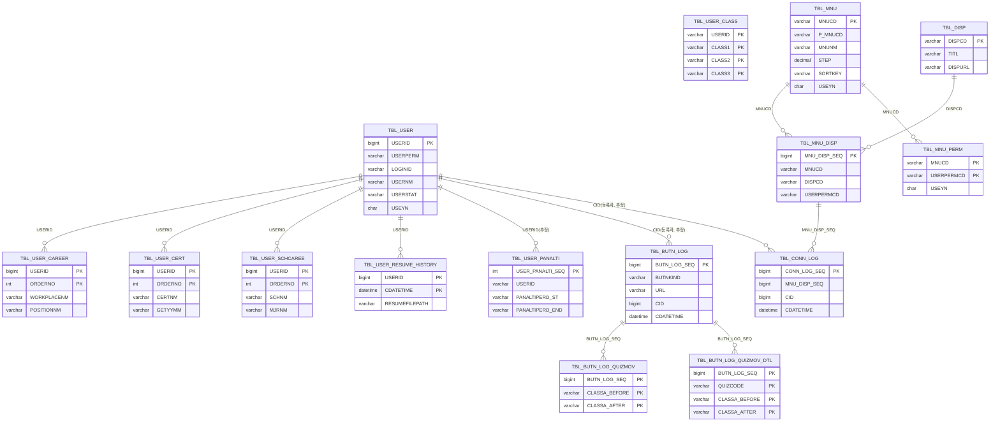
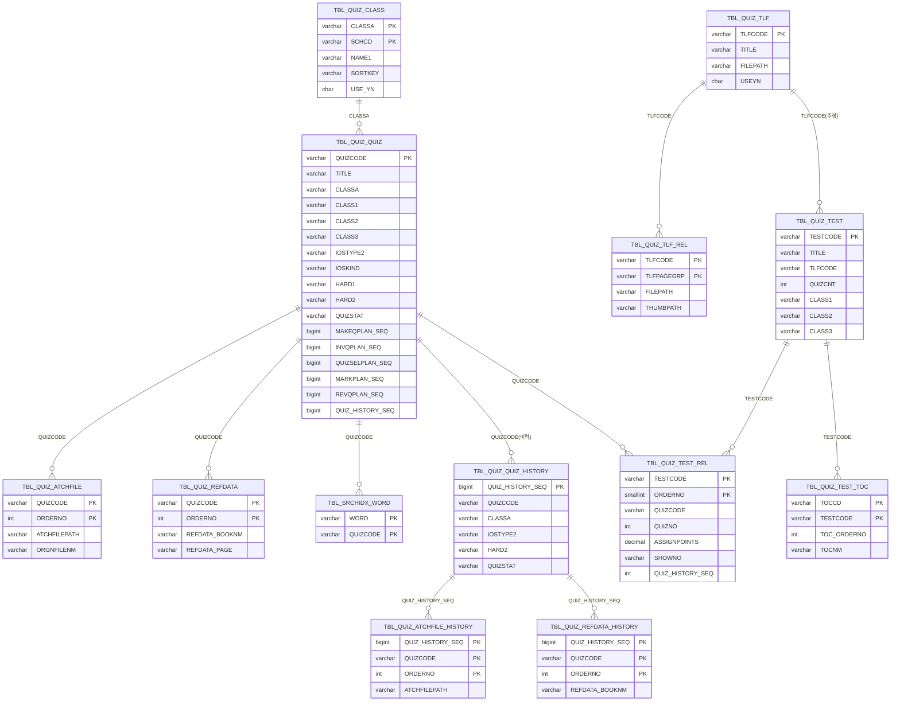

# ERD 초안 (제공된 DDL 기준)

본 ERD는 사용자가 제공한 `CREATE TABLE` 구문(일부 발췌)에 포함된 테이블들을 기준으로 **논리 관계를 추정**하여 작성한 초안입니다.

- 본 DDL에는 **FOREIGN KEY 제약이 거의/전혀 정의되어 있지 않으므로**, 관계선은 **PK/컬럼명 패턴(예: *_SEQ, USERID, QUIZCODE, TESTCODE 등)** 을 기반으로 추정했습니다.
- 실제 서비스 로직/쿼리에서 참조하는 키(특히 `varchar USERID` vs `bigint USERID`)는 타입 불일치가 존재하므로, 구현/운영 기준에 맞춰 최종 확정이 필요합니다.

---

## 1. 사용자/권한/메뉴/로그 영역

---

## 2. 계획(개발/심사/출제/채점/정리) 영역

```mermaid
erDiagram
    TBL_MAKEQPLAN {
        bigint MAKEQPLAN_SEQ PK
        varchar MAKEQPLANNM
        varchar CLASS1
        varchar CLASS2
        varchar YYYY
        int NO
        char USEYN
    }

    TBL_MAKEQPLAN_CMIT_ASSIGN {
        bigint MAKEQPLAN_SEQ PK
        varchar CLASS3 PK
        bigint MAKEQ_USERID PK
        char REQYN
    }

    TBL_MAKEQPLAN_QUIZ {
        bigint MAKEQPLAN_SEQ PK
        varchar CLASS3 PK
        bigint MAKEQ_USERID PK
        varchar QUIZCODE PK
        int QUIZNO
        varchar GOAL_IOSTYPE2
        varchar GOAL_HARD2
        varchar GOAL_CLASSA
    }

    TBL_INVQPLAN {
        bigint INVQPLAN_SEQ PK
        bigint MAKEQPLAN_SEQ
        varchar INVQPLANNM
        varchar CLASS1
        varchar CLASS2
        varchar YYYY
        int NO
        char USEYN
    }

    TBL_INVQPLAN_CMIT_ASSIGN {
        bigint INVQPLAN_SEQ PK
        varchar CLASS3 PK
        bigint INVQ_USERID PK
        varchar REQYN
    }

    TBL_INVQPLAN_QUIZ {
        bigint INVQPLAN_SEQ PK
        varchar CLASS3 PK
        varchar QUIZCODE PK
        bigint MAKEQPLAN_SEQ
        bigint EACHINVQ1_CMITID
        bigint EACHINVQ2_CMITID
        bigint WITHINVQ_CMITID
    }

    TBL_QUIZSELPLAN {
        bigint QUIZSELPLAN_SEQ PK
        varchar QUIZSELPLANNM
        varchar CLASS1
        varchar CLASS2
        varchar YYYY
        int NO
        varchar PGSGGB
        char USEYN
    }

    TBL_QUIZSELPLAN_CMIT_ASSIGN {
        bigint QUIZSELPLAN_SEQ PK
        varchar CLASS3 PK
        bigint QUIZSEL_USERID PK
        char QUIZSELCLOSYN
    }

    TBL_QUIZSELPLAN_FIELD {
        bigint QUIZSELPLAN_SEQ PK
        varchar CLASS3 PK
        varchar TESTCODE_A
        varchar TESTCODE_B
        bigint QUIZSEL_AUTOCOND_SEQ
    }

    TBL_QUIZSELPLAN_QUIZ {
        bigint QUIZSELPLAN_SEQ PK
        varchar CLASS3 PK
        int QUIZSELSET_TYPE PK
        varchar QUIZCODE PK
        bigint QUIZSEL_USERID
        int TESTQUIZNO
        varchar QUIZSELSTAT
        varchar CLASSA
    }

    TBL_MARKPLAN {
        bigint MARKPLAN_SEQ PK
        varchar MARKQPLANNM
        varchar CLASS1
        varchar CLASS2
        varchar YYYY
        int NO
        char USEYN
    }

    TBL_MARKPLAN_CMIT_ASSIGN {
        bigint MARKPLAN_SEQ PK
        varchar CLASS3 PK
        bigint MARK_USERID PK
        varchar REQYN
    }

    TBL_MARKPLAN_QUIZ {
        varchar QUIZCODE PK
        varchar CLASS3 PK
        bigint MARKPLAN_SEQ PK
        varchar TESTTYPE PK
        bigint QUIZ_HISTORY_SEQ
        bigint MARKCMIT1_CMITID
        bigint MARKCMIT2_CMITID
    }

    TBL_MARKPLAN_EXMNE {
        varchar EXMNE_NO PK
        bigint MARK_PLAN_SEQ PK
        varchar CLASS1
        varchar CLASS2
        varchar CLASS3
        varchar NM
    }

    TBL_MARKPLAN_CMIT_QUIZ_EACHMARK {
        bigint MARKPLAN_SEQ PK
        varchar CLASS3 PK
        varchar QUIZCODE PK
        varchar TESTTYPE PK
        bigint MARK_USERID PK
        varchar APYEXAMNO PK
        decimal EACHMARK_HITPOINT
    }

    TBL_REVQPLAN {
        bigint REVQPLAN_SEQ PK
        varchar REVQPLANNM
        varchar CLASS1
        varchar CLASS2
        varchar YYYY
        int NO
        char USEYN
    }

    TBL_REVQPLAN_CMIT_ASSIGN {
        bigint REVQPLAN_SEQ PK
        varchar CLASS3 PK
        bigint REVQ_USERID PK
        char REQYN
    }

    TBL_REVQPLAN_QUIZ {
        bigint REVQPLAN_SEQ PK
        varchar CLASS3 PK
        varchar QUIZCODE PK
        bigint REVQ_USERID
        varchar REVQSTAT
    }

    %% Relationships (추정)
    TBL_MAKEQPLAN ||--o{ TBL_MAKEQPLAN_CMIT_ASSIGN : "MAKEQPLAN_SEQ"
    TBL_MAKEQPLAN ||--o{ TBL_MAKEQPLAN_QUIZ : "MAKEQPLAN_SEQ"

    TBL_MAKEQPLAN ||--o{ TBL_INVQPLAN : "MAKEQPLAN_SEQ(추정)"
    TBL_INVQPLAN ||--o{ TBL_INVQPLAN_CMIT_ASSIGN : "INVQPLAN_SEQ"
    TBL_INVQPLAN ||--o{ TBL_INVQPLAN_QUIZ : "INVQPLAN_SEQ"

    TBL_QUIZSELPLAN ||--o{ TBL_QUIZSELPLAN_CMIT_ASSIGN : "QUIZSELPLAN_SEQ"
    TBL_QUIZSELPLAN ||--o{ TBL_QUIZSELPLAN_FIELD : "QUIZSELPLAN_SEQ"
    TBL_QUIZSELPLAN ||--o{ TBL_QUIZSELPLAN_QUIZ : "QUIZSELPLAN_SEQ"

    TBL_MARKPLAN ||--o{ TBL_MARKPLAN_CMIT_ASSIGN : "MARKPLAN_SEQ"
    TBL_MARKPLAN ||--o{ TBL_MARKPLAN_QUIZ : "MARKPLAN_SEQ"
    TBL_MARKPLAN ||--o{ TBL_MARKPLAN_EXMNE : "MARK_PLAN_SEQ"

    TBL_MARKPLAN_QUIZ ||--o{ TBL_MARKPLAN_CMIT_QUIZ_EACHMARK : "MARKPLAN_SEQ/QUIZCODE/TESTTYPE"

    TBL_REVQPLAN ||--o{ TBL_REVQPLAN_CMIT_ASSIGN : "REVQPLAN_SEQ"
    TBL_REVQPLAN ||--o{ TBL_REVQPLAN_QUIZ : "REVQPLAN_SEQ"
```

---

## 3. 문항/시험지/이력/첨부/분류 영역

---

## 4. 보완 필요 포인트(확정 전 체크)
1. **FK 미정의**: 운영/개발에서 참조되는 실제 FK를 추가로 확인 필요(또는 애플리케이션 레벨로 강제).
2. **USERID 타입 혼재**: `tbl_user.USERID(bigint)` vs 일부 테이블의 `USERID(varchar)` → 표준화 권장.
3. **계획↔문항 연결**: `tbl_quiz_quiz`에 여러 *_PLAN_SEQ가 존재하므로, “단일 최신 참조인지 / 이력성 참조인지” 정책 확정 필요.
4. **분류 체계**: `CLASS1~12`, `CLASSA`, `tbl_quiz_class`의 역할 분리(코드/명칭/트리 구조) 정의 필요.
5. **이력 테이블 연계**: `*_HISTORY`는 `QUIZ_HISTORY_SEQ`, `TEST_HISTORY_SEQ` 중심으로 묶이므로, 생성/확정 시점 트리거/프로시저 정책 확인 필요.

---

## 5. 산출물 형태
- 본 문서는 ERD 초안(mermaid) 형태이며,
- 원하시면 다음 산출물로 확장 가능합니다.
  - (1) 테이블 목록/키/인덱스 요약표
  - (2) FK 후보 리스트(정규화/타입 표준화 포함)
  - (3) 업무도메인별 ERD 분리(출제/심사/채점/정리/시스템)
